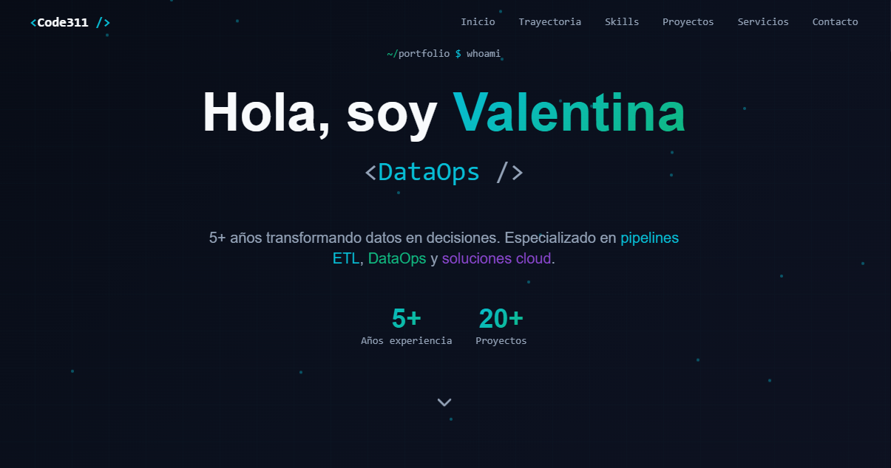

# Valentina Code311 - Portfolio

Portfolio profesional de **Valentina Code311**, Data Engineer especializada en DataOps, soluciones cloud (GCP/AWS) y automatizacion con IA.



## Tech Stack

| Capa | Tecnologias |
|------|-------------|
| **Framework** | React 18, TypeScript, Vite |
| **UI** | Tailwind CSS, shadcn/ui (Radix UI), Lucide Icons |
| **Routing** | React Router DOM |
| **Testing** | Vitest, Testing Library |
| **Contenedor** | Docker (multi-stage con Nginx) |
| **CI/CD** | GitHub Actions |
| **Hosting** | Google Cloud Run + Artifact Registry |

## Estructura del Proyecto

```
src/
├── components/        # Componentes principales del sitio
│   ├── Hero.tsx       # Seccion de bienvenida con animacion de escritura
│   ├── About.tsx      # Linea de tiempo profesional (2021-2025)
│   ├── Skills.tsx     # Habilidades tecnicas con barras de progreso
│   ├── Projects.tsx   # Proyectos destacados con vista expandible
│   ├── Services.tsx   # Servicios ofrecidos
│   ├── Contact.tsx    # Informacion de contacto y redes sociales
│   ├── Navbar.tsx     # Navegacion responsive con menu movil
│   └── ui/            # Componentes de shadcn/ui
├── pages/
│   ├── Index.tsx      # Pagina principal (SPA)
│   └── NotFound.tsx   # Pagina 404
├── hooks/             # Custom hooks (mobile detection, toast)
└── lib/               # Utilidades (cn class merger)

docker/
└── front.Dockerfile   # Build multi-stage (Node 20 + Nginx)

scripts/
├── deploy.sh          # Despliegue a Cloud Run
├── setup.sh           # Configuracion de infraestructura GCP
├── startup.sh         # Instalador de herramientas (gcloud, docker, aws, jq)
└── gcp_login.sh       # Autenticacion GCP

.github/workflows/
└── gcp-deploy.yml     # Pipeline CI/CD automatico
```

## Desarrollo Local

Requisitos: [Node.js](https://nodejs.org/) >= 18

```sh
# Instalar dependencias
npm install

# Iniciar servidor de desarrollo (puerto 8080)
npm run dev

# Ejecutar tests
npm test

# Lint
npm run lint

# Build de produccion
npm run build
```

## Docker

```sh
# Build y levantar con Docker Compose (puerto 8081)
docker compose up --build

# O build manual
docker build -f docker/front.Dockerfile -t c311-front .
docker run -p 8081:80 c311-front
```

## Despliegue

El proyecto se despliega automaticamente en **Google Cloud Run** cuando se hace push a `main` con cambios en `src/`.

### Configuracion Inicial de GCP

```sh
# Configurar infraestructura (Artifact Registry, service accounts, IAM)
sh scripts/setup.sh
```

### Despliegue Manual

```sh
# Desplegar frontend
sh scripts/deploy.sh front
```

### Variables de Entorno

Los secretos se gestionan via GitHub Variables/Secrets y se inyectan durante el CI/CD:

| Variable | Descripcion |
|----------|-------------|
| `ENV_FILE` | Contenido del archivo `.env` principal |
| `FRONTEND_ENV_FILE` | Variables del frontend (`VITE_API_URL`, etc.) |
| `GCP_CREDENTIALS_JSON` | Credenciales de servicio GCP |

## Scripts Disponibles

| Comando | Descripcion |
|---------|-------------|
| `npm run dev` | Servidor de desarrollo con HMR |
| `npm run build` | Build de produccion |
| `npm run build:dev` | Build en modo desarrollo |
| `npm run preview` | Preview del build de produccion |
| `npm test` | Ejecutar tests (una vez) |
| `npm run test:watch` | Tests en modo watch |
| `npm run lint` | Ejecutar ESLint |
